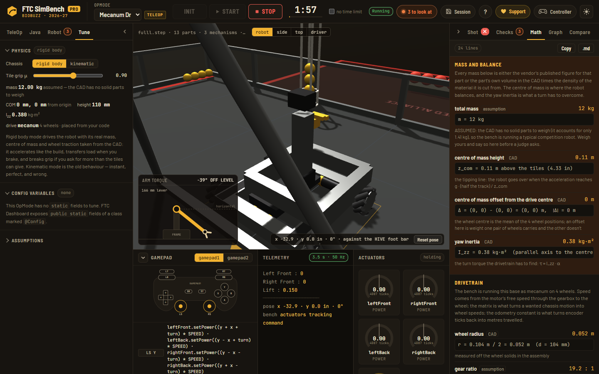
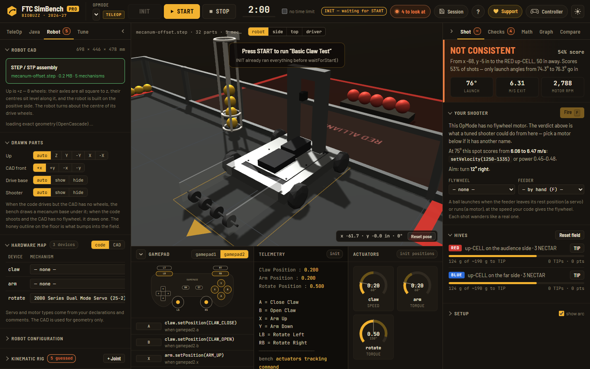
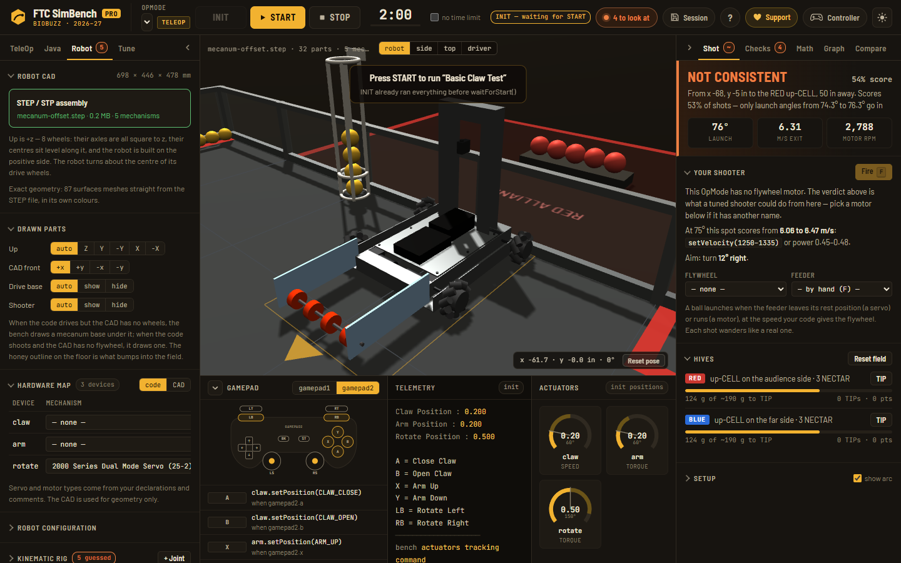
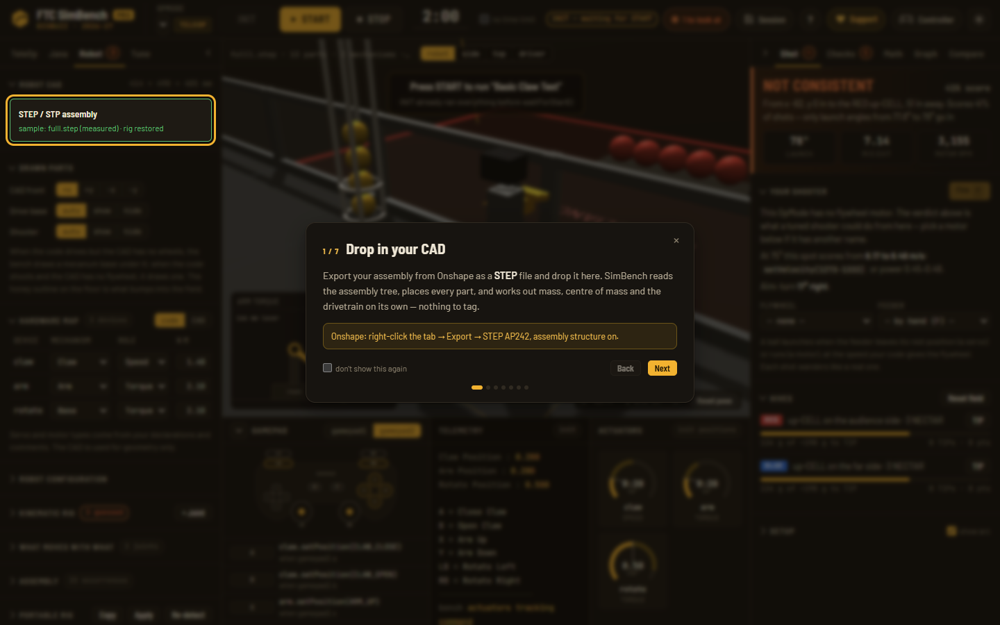
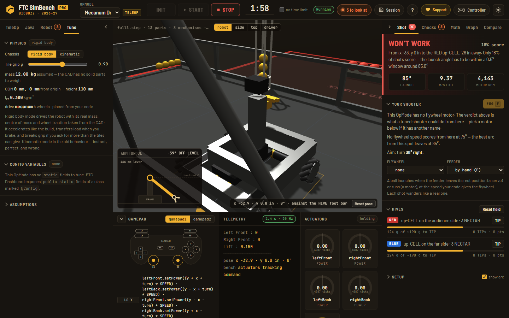

# FTC SimBench Pro

**Private and proprietary.** This repository is not open source. See [LICENSE](LICENSE).
The public, MIT-licensed bench it was forked from lives at
[LILRINO71/ftc-sim-bench](https://github.com/LILRINO71/ftc-sim-bench) — anything you add here
stays here.

Drop in a STEP assembly and a Java OpMode. SimBench Pro resolves the kinematic tree, works out the
robot's real mass, balance and traction from the CAD, interprets the code at 50 Hz, and lets you
drive and shoot on the 2026-27 BIOBUZZ field — then hands you the math behind all of it.

Ships as one self-contained HTML file. No accounts, no install, no server: everything runs in the
browser, so a team can open it on the laptop that's already in the pit.



## Run it

```bash
npm run build          # dev build  -> dist/index.html
npm test               # the whole suite
```

Open `dist/index.html`, or serve `dist/` on any static host. `dist/` is build output and is not committed (see AGENTS.md).

```bash
npm run build:ship     # ship build: comments and layout stripped
node tools/build.mjs --min --strings   # ship build + string table
```

Deployment to `app.ftc-simbench.com` is in [DEPLOY.md](DEPLOY.md).

## What's in it

| | |
|---|---|
| **Zero-config CAD** | `step.js` resolves the assembly tree and places every part; `hull.js` gives each one a solid shape; `inertia.js` turns those into mass, centre of mass and inertia; `drivetrain.js` finds the wheels and works out whether it's mecanum, tank, X-drive, omni or swerve — without you tagging anything. |
| **Rigid-body physics** | `dynamics.js` drives the chassis with motor torque curves, per-wheel normal loads with load transfer, and a slip-limited friction model. The robot accelerates like the build, leans under braking, and breaks traction when you ask for more than the tiles can give. |
| **Real code** | `java.js` interprets your OpMode — servos with stall torque, encoders and PID, `RUN_TO_POSITION`, autonomous sleeps and wait loops. Not a rewrite, not a stub. |
| **BIOBUZZ field** | The measured field from the [BIOBUZZ Shot Sim](https://github.com/LILRINO71/biobuzz-shot-sim), vendored in `vendor/`: leaning A-frame HIVEs, bistable pentagonal CELLs, wall FLOWERs, staged POLLEN and NECTAR, and the ~190 g tipping point. |
| **Show Math** | `mathdoc.js` prints the equations for *your* robot with your numbers substituted — gear ratios, holding torque, odometry, traction limits, feedforward — and exports as Markdown for an Engineering Portfolio. |
| **Workspaces** | `session.js` bundles the parsed CAD, the map, the code and the pose into a `.ftcsim` file. Drag it back in and you're where you left off, with no STEP to re-parse. |
| **Controllers** | Any standard gamepad, assigned to gamepad1 or gamepad2, with rumble. |

### The robot as Onshape draws it

Drop a STEP file and OpenCascade (occt-import-js, loaded from jsDelivr the first time, run in a
Web Worker) meshes every real surface, in the file's own colours, and each mesh rides the
mechanism of the part it came from. Until it answers — or if it can't, offline — the robot is
drawn from simplified shapes, never blank.

| before: a convex hull per part | after: the STEP file's own surfaces |
|---|---|
|  |  |

### Any robot? The corpus says which

`tests/fixtures/robots/` holds 14 Onshape-style robots with real B-rep geometry, each checked
against OpenCascade: mecanum (Z-up, Y-up, inch units, front along +y, origin 0.6 m off with an
intake out the front, unnamed parts, nested four levels deep, 1,500 parts), tank, 6WD drop-centre,
X-drive, kiwi, swerve and an arm with no drivetrain. `tests/anyrobot.test.mjs` runs each through
the whole engine — parse, drivetrain, mass, frame — and spins it in place, asserting the TRUE
drivetrain centre never moves more than 5 mm at any moment. All 14 pass.

### The walkthrough, once, on first load



### The physics panel: what the bench is really driving



## Layout

```
src/     engine modules, concatenated in one scope by the build (no modules, no bundler)
  step.js hull.js inertia.js drivetrain.js dynamics.js   CAD -> physics
  expr.js java.js mapping.js analyze.js                  code -> behaviour
  field.js shots.js                                      BIOBUZZ
  session.js mathdoc.js gitimport.js onboarding.js       product layer
  sim.js view3d.js app.js                                the running bench
tools/   build.mjs (dev + ship), minify.mjs, test.mjs, sync-shot-sim.mjs
tests/   node:test — the engine is loaded and tested exactly as it ships
vendor/  BIOBUZZ Shot Sim (MIT, ours)
```

Every `src/*.js` is a plain script fragment: no `import`/`export`, top-level declarations shared in
one `"use strict"` scope. `tools/build.mjs` concatenates them in `ORDER`. Engine files never touch
the DOM — only `view3d.js` and `app.js` do — which is why `tests/load.mjs` can run the real engine
in Node with no mocks.

## Honest limits

- **The physics is a model, not a measurement.** Mass comes from CAD volume and material density
  (or a vendor figure when the part is recognised), so it is an estimate with a stated confidence,
  and every number in the Math tab says where it came from. Check a real robot on a real field
  before you bet a match on it.
- **Shipped code can be read.** The ship build strips comments and can hide string literals, which
  raises the effort of lifting the model — it is not encryption. Anything that must stay secret
  cannot live in a browser bundle.
- **GitHub import** uses the public API from the user's browser: public repositories only, and
  GitHub rate-limits unauthenticated requests to 60 an hour.
