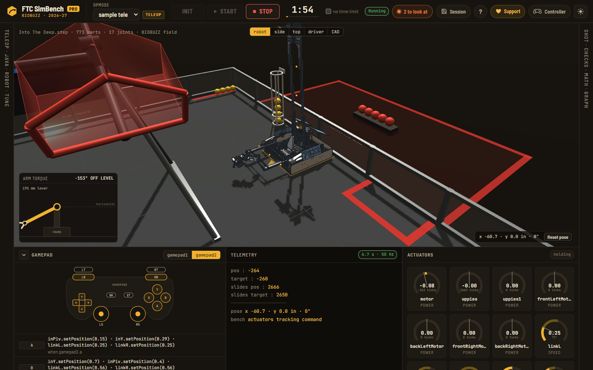
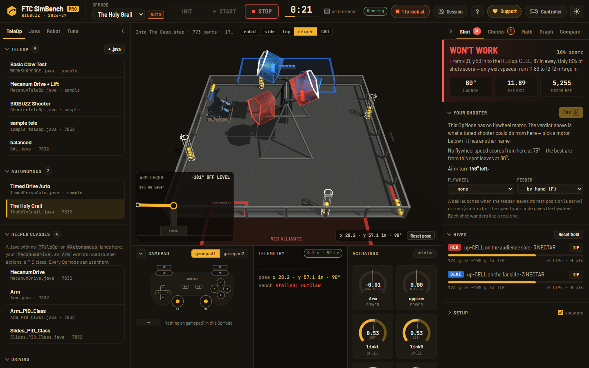

# FTC SimBench Pro

**Put any FTC robot's CAD and its real Java code into a browser, and watch that robot run that code.**
It runs on the 2026-27 BIOBUZZ field, with its own mass, motors and traction, and the math behind
every number.

**Live:** https://ftc-simbench-pro.pages.dev · rebuilt from `main` on every push



*GearGurus 7832's 2024-25 robot, from the team's own Onshape export, running the team's own
`sample_teleop.java`. Gamepad 2's Y raised the four-stage lift 0.69 m and swung the outtake arm to
the basket. A pushed the intake out 226 mm through its servo linkage and dropped the claw. Nothing
here was re-coded for the simulator.*

---

## What we're building

FTC teams write most of their code before the robot is finished, and then test it on a robot that
is also being rebuilt. Existing simulators want the robot modelled again inside the simulator.
Teams don't have time for that, and the model drifts from the real robot.

SimBench Pro starts from what a team already has:

1. **The CAD** they built the robot from, exported as a STEP file (Onshape, Fusion, SolidWorks).
2. **The OpModes** they already run on the Control Hub: TeleOps and Road Runner autos, as `.java`.

From those two things alone it works out the robot:
- **Frame and drivetrain:** where up is, where the drivetrain centre is, and what the drivetrain is (mecanum, tank, swerve, kiwi, X-drive).
- **Mass:** weight, centre of mass and inertia.
- **Actuators:** which motors and servos drive what.
- **Joints:** how every mechanism moves.

It then runs the code at 50 Hz against a rigid-body model on the season's field. You drive it
with a real gamepad and see what the code does, before the robot exists or while it's in pieces.

**The hard part is joints.** A STEP file has shapes and positions, but no hinges and no slides.
Getting from "773 parts" to "this lift, this arm, this claw, moving this way" is most of the
project. There are four layers, from exact to automatic:

| Layer | What it is | Status |
|---|---|---|
| **Onshape mates** | Read the assembly's own mates from Onshape: exact axes, travel limits and gear relations, with no guessing. | ✅ `src/mates.js` |
| **Joint spec** | A small JSON file that says the same by hand: parts, axis, pivot, travel, which device drives it. It also covers cascade slides and servo slider-crank linkages. | ✅ `src/jointspec.js`, [docs/joints.md](docs/joints.md) |
| **Click-to-fix editor** | In the CAD view: click parts, pick what they ride on, make a joint (the axis is suggested from the selected spline, gear or rail), flip it, try it. Every edit is a joint spec you can download. | ✅ `src/cadview.js` |
| **Automatic joint finder** | Finds actuators, slide stacks and the parts each joint carries, straight from geometry, for any STEP. | 🔬 prototyped and measured: [research/autorig](research/autorig/README.md); being built into the app |

The goal: drop in any robot and get the right joints automatically, with the editor there to fix
whatever the finder gets wrong. You shouldn't need a hand-written spec per robot.

## What it does today

| | |
|---|---|
| **Any robot's CAD** | `step.js` resolves the assembly tree. `frame.js` puts every robot in one frame (+z up, origin at the drivetrain centre on the floor). `drivetrain.js` finds the wheels, the drivetrain type and each motor's mounting. `inertia.js` works out mass, centre of mass and inertia from part shapes and vendor data. Tested on 14 generated robots of every drivetrain type and on a real 773-part robot. |
| **The robot as Onshape draws it** | `tessellate.js` meshes every real surface with OpenCascade in Web Workers, one small STEP per unique shape. The real robot has 99 shapes, placed 773 times, in about 12 s. `view3d.js` draws them with realistic materials; the wheels spin with their motors. `cadview.js` is an Onshape-style CAD view with a view cube, instance tree, part picking and mass properties. |
| **Real code, unmodified** | `java.js` + `expr.js` interpret LinearOpMode/OpMode TeleOps and autos: hardware maps, directions, encoders, `RUN_TO_POSITION`, FTCLib PID (with its real integral bounds), timers, sleeps, switch/enum state machines. Gamepads map to gamepad1/2, with rumble. |
| **Road Runner 1.0 autos** | `roadrunner.js` reads `TrajectoryActionBuilder` chains, `Actions.runBlocking` trees, and the team's own `Action` classes from their helper files (an `Arm` class, a PID class, `MecanumDrive` and its `PARAMS`). It builds the paths, time-profiles them, and follows them with the team's gains. See [docs/code-support.md](docs/code-support.md). |
| **Rigid-body physics** | `dynamics.js` models motor torque curves, per-wheel normal loads with load transfer, and slip-limited friction. Motor direction follows the FTC SDK: FORWARD turns the shaft clockwise seen from the shaft end, and the CAD says how each motor is mounted. |
| **Checks** | `analyze.js` reads the code against the robot: devices mapped or not, servos that stall, sleeps that freeze a TeleOp, slides the code never powers, a drive probe that says whether the sticks drive this robot the way a driver expects, and a lookup with a stray space in its config name. |
| **Show the math** | `mathdoc.js` prints the equations for *your* robot with your numbers in them (gear ratios, holding torque, traction limits, feedforward) and exports Markdown for an Engineering Portfolio. |
| **BIOBUZZ field** | The measured 2026-27 field from the [BIOBUZZ Shot Sim](https://github.com/LILRINO71/biobuzz-shot-sim), vendored in `vendor/`: HIVEs, CELLs, FLOWERs, POLLEN and NECTAR, and a shot model. |
| **Workspaces** | `session.js` saves the parsed robot, its joints, the code and the pose as a `.ftcsim` file; opening it needs no STEP re-parse. OpModes can also be imported straight from a GitHub repo. |

## Try it

Open **https://ftc-simbench-pro.pages.dev**. It loads GearGurus 7832's Into The Deep robot
([assets/robots/into-the-deep](assets/robots/into-the-deep/README.md)) with the team's `sample tele`.

- **START**, then gamepad 2 (or the keys shown on the page):
  - **Y:** high basket (lift up, arm back)
  - **X:** hand-off pose
  - **A:** intake out, arm down
  - **B:** intake back in
  - **bumpers:** claws
- Pick **The Holy Grail** under Autonomous to run the team's Road Runner specimen auto. It was
  written for the Into The Deep field, so it runs against the walls only.
- The **CAD** button opens the CAD view. Click a part, and its panel shows the joint it rides on,
  the joint's axis, and a slider to try it.
- **Drop your own robot anywhere on the page:** a `.step`, your `.java` OpModes, and any helper
  classes. Add an Onshape assembly JSON or a joint spec if you have one.
- `?robot=sample` opens the small built-in sample instead.

| The joint editor | The team's Road Runner auto |
|---|---|
|  |  |

## How it works

```
 STEP file ──► step.js ──► frame.js ──► drivetrain.js · inertia.js ──► joints ──┐
 (Onshape,     parts,      +z up,       wheels, drive type,           mates.js │
  Fusion…)     assembly    origin at    motor mounting,               jointspec│
               tree        drive centre mass & inertia                editor   │
                                                                               ▼
 .java OpModes ──► java.js · expr.js ──► mapping.js ──────────────────► sim.js ──► dynamics.js
 + helper files    roadrunner.js        which device                   50 Hz       rigid body,
                   (statement tree,     drives which joint             Driver      wheels, slip
                    RR paths, actions)                                 Station     on field.js
                                                                               │
                         tessellate.js (OpenCascade) ──► view3d.js · cadview.js ◄┘
                         analyze.js · mathdoc.js ──► Checks, Math, Graph tabs
```

Every `src/*.js` is a plain script fragment. `tools/build.mjs` concatenates them into one page;
there's no bundler and no framework. Only `tessellate.js`, `view3d.js`, `cadview.js` and `app.js`
touch the browser. Everything else is the **engine**, which `tests/load.mjs` loads into Node
exactly as it ships, so the whole simulator is tested without a browser. The module map is in
[src/README.md](src/README.md).

## Repository map

| Path | What's there |
|---|---|
| [`src/`](src/README.md) | The app: engine modules, the 3D and CAD views, the UI. |
| [`tests/`](tests/README.md) | 454 `node:test` tests: the robot corpus, physics, parser, Road Runner, the real robot end to end. |
| [`tools/`](tools/README.md) | The build, the minifier, the test runner, the robot corpus generator, the Onshape mates CLI. |
| [`assets/robots/`](assets/robots/into-the-deep/README.md) | The default robot: GearGurus 7832's STEP (gzipped), its joint spec, and the team's OpModes. |
| [`research/autorig/`](research/autorig/README.md) | The automatic joint finder study: three prototypes, measured against the real robot. |
| [`docs/`](docs/README.md) | Guides ([joints](docs/joints.md), [code support](docs/code-support.md)) and the screenshots. |
| `vendor/biobuzz-shot-sim/` | The BIOBUZZ field and shot engine (MIT, ours), synced by `tools/sync-shot-sim.mjs`. |
| [`AGENTS.md`](AGENTS.md) | How the two coding agents on this repo work together: rules, file claims, shared conventions. |
| [`DEPLOY.md`](DEPLOY.md) | Hosting on Cloudflare Pages. |

## Build and test

```bash
npm install            # dev dependency only: occt-import-js, for the geometry tests
npm run build          # dev build  -> dist/index.html (open it, or serve dist/)
npm test               # the whole suite: 454 tests
npm run build:ship     # what Cloudflare Pages builds: comments and layout stripped
```

`dist/` is build output and isn't committed. Cloudflare Pages builds it on every push to `main`;
check the live build by comparing its `SIMBENCH_BUILD` hash with a local ship build.

## Honest limits

- **The physics is a model, not a measurement.** Mass comes from CAD shapes and material density,
  or from a vendor figure when a part is recognised. Every number in the Math tab says where it
  came from. Check a real robot on a real field before you bet a match on it.
- **Joints without Onshape mates are still partly manual.** The automatic finder is measured on
  one real robot so far (see [research/autorig](research/autorig/README.md)). Until it ships, a
  robot without mates gets the old nearest-mechanism guess, which the editor can fix.
- **Road Runner is emulated, not run.** Paths, timing, markers and every action are the team's.
  The follower uses the team's gains, but its feedforward is the bench's own, taken from the CAD's
  motors and wheels, and the localizer is perfect. Tuned `kS`/`kV`/`kA` values belong to one real
  robot's encoders and battery.
- **Shipped code can be read.** The ship build strips comments, which is not encryption. Nothing
  secret belongs in a browser bundle.

## License and credits

The repository is public so it can be read, but it is **not open source**: all rights reserved,
see [LICENSE](LICENSE). The free, MIT-licensed bench it grew from is
[LILRINO71/ftc-sim-bench](https://github.com/LILRINO71/ftc-sim-bench).

- The default robot and its code are GearGurus 7832's, published at the team's request. The code
  is BSD-3-Clause-Clear, credited in [its folder](assets/robots/into-the-deep/README.md).
- OpenCascade meshing is [occt-import-js](https://github.com/kovacsv/occt-import-js) (LGPL-2.1),
  loaded from jsDelivr at run time.
- 3D is [three.js](https://threejs.org) r128 (MIT).
