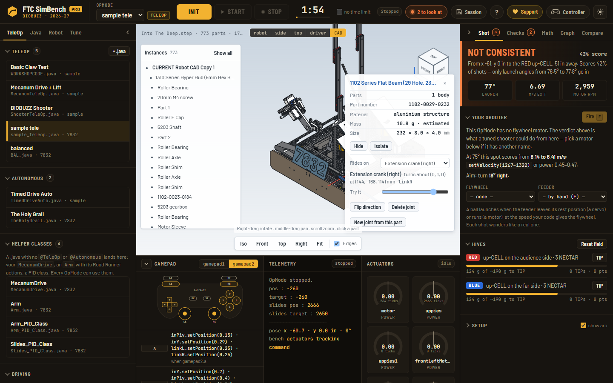

# Joints: how a STEP file becomes a moving robot

A STEP export describes every part's shape and where it sits. It has no hinges, no slides, no
motors attached to anything. Before a robot can move, the bench has to know, for every
mechanism:

- the **parts** that ride on it
- its **axis** and **pivot** (or slide direction), in the robot frame
- how far it can **travel**
- which **device** in the code drives it, and how the code's numbers turn into motion (encoder ticks per turn, mm per tick, the servo position the CAD was drawn at)
- what it **follows**: a cascade slide stage, a meshed gear, a linkage

There are four ways to get those. They all end up as the same mechanisms, so the sim, the
Checks tab and the 3D view treat them alike.

## 1. Onshape mates: exact

If the robot is in Onshape, its assembly already has every mate. `src/mates.js` reads the
assembly definition (`GET /api/assemblies/d/…/w/…/e/…?includeMateFeatures=true`). It groups parts
fastened together into rigid bodies and walks the moving mates (revolute, slider, cylindrical,
pin-slot) out from the chassis as a joint tree. Each joint gets its true axis and pivot, the parts
it carries, its limits from the features list, and any gear, rack or screw relation to another
joint.

The **Mates & joints** panel on the Robot tab builds the two API links from an assembly URL. Open
them in a browser that's signed in to Onshape, save the pages, and drop them on the panel. No API
keys are needed. For scripting there's `tools/onshape-mates.mjs`.

## 2. A joint spec: written down once

No Onshape, or mates that don't match how the robot really moves? A joint spec says the same
things in a small JSON file (`format: "ftc-sim-bench.joints"`). It is kept next to the robot,
dropped on the same panel, and applied every time that STEP is loaded.
[`assets/robots/into-the-deep/joints.json`](../assets/robots/into-the-deep/joints.json) is a full
real example: 17 joints, including a four-stage lift, a gear-coupled claw and a servo slider-crank
linkage.

Units are **millimetres and degrees**, in the bench's robot frame: +z up, origin at the drivetrain
centre on the floor. A joint turns right-handed about its axis, or slides along it, as the value
the code sends goes up, after any `setDirection(REVERSE)` in the code.

```jsonc
{
  "format": "ftc-sim-bench.joints", "version": 1,
  "robot": "Team 1234 · Example",
  "front": "-x",                          // which way the robot's front faces (optional)
  "joints": [
    {
      "id": "lift", "label": "Lift",
      "kind": "slider",                   // "slider" or "revolute"
      "axis": [0, 0, 1], "pivot": [0, 0, 97],
      "device": ["uppies", "uppies1"],    // variable or configuration names
      "part": "5203-2402-0019",           // the actuator, for its speed and torque
      "mmPerTick": 0.26,                  // slide travel per encoder tick
      "limits": [0, 700],                 // mm for a slide, degrees for a turn
      "parts": [                          // which parts ride it (see "Picking parts")
        { "in": "(^|/)Left SAR 230/SAR2XX/", "x": [-40, -11] }
      ]
    },
    { "id": "lift stage 2", "kind": "slider", "axis": [0, 0, 1], "pivot": [0, 0, 97],
      "follows": { "joint": "lift", "ratio": 0.3333 },            // a cascade stage
      "parts": [ { "in": "SAR2XX/", "x": [3, 17] } ] },
    { "id": "arm", "kind": "revolute", "axis": [0, 1, 0], "pivot": [-49.5, 0, 352],
      "parent": "lift",                   // rides on the lift
      "device": "Arm", "part": "5203-2402-0051", "limits": [-305, 8],
      "parts": [ { "in": "/Outtake Arm/" } ] },
    { "id": "claw", "kind": "revolute", "axis": [0.44, 0.35, 0.83], "pivot": [177, 62, 250],
      "parent": "arm", "device": "outClaw",
      "restPos": 0.43,                    // the servo position the CAD was drawn at
      "parts": [ { "solid": [127, 308] } ] },
    { "id": "extend", "kind": "slider", "axis": [-1, 0, 0], "pivot": [-46, 0, 103],
      "follows": { "joint": "crank", "linkage": "slider-crank",   // pushed by a servo crank
                   "crankPin": [176.5, -168, 259], "pin": [-46, -168, 103] },
      "parts": [ { "in": "/Intake/" } ] }
  ],
  "assign": [                             // hand fixes, applied last (the editor writes these)
    { "joint": "chassis", "parts": [ { "solid": [42] } ] }
  ]
}
```

| Field | Meaning |
|---|---|
| `id`, `label` | Name in the UI and in `parent` / `follows`. |
| `kind` | `slider` or `revolute`. |
| `axis`, `pivot` | Direction (unit or not) and a point on the axis, in mm. |
| `parent` | The joint this one rides on (default: the chassis). |
| `device` | The code device or devices that drive it, by variable name or configuration name. |
| `part` | The actuator's part number: speed, torque, ticks per revolution (e.g. `5203-2402-0051` = 50.9:1, 1425.1 ticks per turn). |
| `mmPerTick`, `gear` | A slide's travel per tick; a turn's reduction after the gearmotor. |
| `limits` | Hard stops: mm for a slider, degrees for a revolute. |
| `restPos` | The servo position the CAD was drawn at. A servo nothing has commanded yet stays here. |
| `offsetDeg` | A drawn-pose fix, for a part the CAD left in an impossible spot (Into The Deep's left linkage was drawn folded through the floor). |
| `follows` | `{joint, ratio}` for a cascade stage or a gear pair (`-1` for a meshed gear). `{joint, linkage:"slider-crank", crankPin, pin}` for a slide pushed by a crank through a rod. `{joint, linkage:"rod", slider, crankPin, pin}` for the rod itself. |
| `parts` | Part picks, below. A later joint's pick wins over an earlier one's, so a child can take parts from its parent. |
| `assign` | Hand fixes applied after all picks: these parts ride this joint, or `"chassis"`. |
| `solids` | How many parts the STEP had when the spec was written, so a spec for another version of the file says so. |

### Picking parts

A pick keeps the parts that pass all of its tests:

- `in`: a case-insensitive regular expression on the part's place in the assembly, `"Sub/Sub/Part name"`
- `not`: the same, to leave parts out
- `x`, `y`, `z`: `[lo, hi]` in mm, the part's centre in the robot frame
- `solid`: `[indices]`, exact parts. Fine for a spec tied to one STEP file; the editor uses these.

## 3. The joint editor: fix it by clicking

Open the **CAD** view and click a part (Ctrl-click to add more). The info panel shows:

- **Rides on**: the joint these parts move with. Pick another joint, or *the frame*, and the parts move there.
- The joint's **axis** drawn through its pivot, with **Flip direction**, **Delete joint**, and a **Try it** slider that moves it before any code runs.
- **New joint from these parts**. The axis and pivot come from what's selected: a spline, shaft or pin turns about its length; a horn, gear, hub or wheel turns about its thin direction; a rail slides along its length. With none of those, the parts' own shape decides. Name the joint, pick the device that drives it and the joint it hangs from, then **Make the joint**.



Every edit is a joint spec: the robot's own, or one written from its current joints the first
time anything changes (`specFromCad`). It's kept per STEP file name in the browser.
**Download joint spec** saves it to share with the team or commit next to the CAD, and **Undo my
joint edits** goes back.

## 4. The automatic joint finder (in progress)

The aim is to need none of the above for most robots. [research/autorig](../research/autorig/README.md)
prototypes the three parts of finding joints from geometry alone and measures them against the
hand-written spec for GearGurus 7832's robot:

| Piece | Result on Into The Deep |
|---|---|
| **Actuators** (every servo and motor output, its axis and pivot) | 15/15 found, 0 false positives, the 9 driven joints within 0.2° and 2.8 mm; still 9/9 with part names removed or the robot rotated |
| **Slides** (stacks, stage order, fixed stage, direction) | both mechanisms found, direction and fixed stage 4/4, 0 false positives |
| **What each joint carries** (contact graph cut at each joint) | 99.7% of 773 parts on the right joint (precision 99.3%, recall 98.6%); 0 parts wrongly moved on 14 robots with no mechanisms |

Next it gets built into the app. A dropped STEP with no mates and no spec gets these joints
automatically. The ones it isn't sure of (a servo with nothing on its output, an actuator type it
has never seen) are listed for a person to check in the editor.

## Before any of these: the old guess

Without mates or a spec, `classifyMechs` in `src/step.js` makes one mechanism per subassembly that
holds an actuator, and every part rides the nearest mechanism. That's fine for a simple arm and
wrong for most real robots: on Into The Deep it put 238 frame parts on joints. It stays as the
fallback until the finder replaces it.
